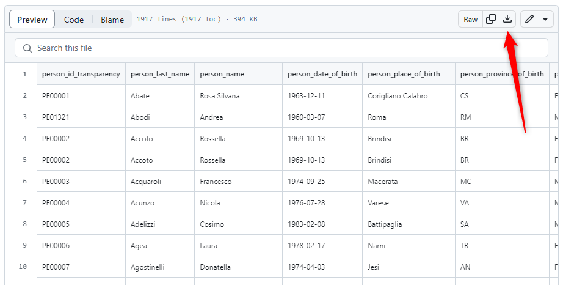

# Introduzione

Questo è un insieme di dati pubblicati nel contesto del progetto "[**Liberiamoli tutti**](https://datibenecomune.substack.com/about)", e in particolare nel "[numero #3](https://datibenecomune.substack.com/p/liberiamoli-tutti-numero-3)".

## Dati

Si tratta delle **erogazioni ai partiti politici** iscritti nel registro nazionale. Sono alcuni dei dati più importanti che **Transparency International Italia** ha usato per l'aggiornamento della piattaforma [**soldiepolitica.it**](https://soldiepolitica.it/) e riferibili ai **finanziamenti** alla **politica** a livello nazionale negli **anni 2022** e **2021**. Il dataset comprende anche i dati relativi agli anni 2018-2020, oggetto della precedente pubblicazione su soldiepolitica.it.

👉 **Nota Bene**: questi sono rilasciati con **licenza** [**CC-BY 4.0**](https://creativecommons.org/licenses/by/4.0/deed.it). 
Li **puoi usare liberamente**, anche per scopi commerciali, ma devi **citare la fonte**, scrivendo semplicemente "Fonte: [Soldi e Politica](https://soldiepolitica.it/)" e inserendo il link ipertestuale a `https://soldiepolitica.it/`.

Sono in formato `CSV`, con separatore `,` e con codifica `UTF-8`.

### persons

Tabella contenente i membri del Parlamento e del Governo, ricavati da fonti pubbliche e consultabili sui siti della Camera dei deputati e del Senato (dati.camera.it e dati.senato.it).

Il file è [`persons.csv`](persons.csv) ed è composto dalle colonne descritte a seguire.

| Nome colonna | Tipologia colonna | Descrizione colonna |
| --- | --- | --- |
| person_id_transparency | string | Codice identificativo della persona, nel dataset di Transparency International Italia |
| person_last_name | string | Cognome della persona |
| person_name | string | Nome della persona |
| person_date_of_birth | date | Data di nascita della persona (anno-mese-giorno) |
| person_place_of_birth | string | Luogo di nascita della persona |
| person_province_of_birth | string | Provincia di nascita della persona |
| person_gender | string | Sesso della persona |
| person_institution | string | Istituzione di appartenenza della persona |
| government_or_legislature | string | Governo o legislatura di appartenenza della persona |
| person_institutional_role | string | Ruolo istituzionale della persona |
| person_political_group | string | Gruppo politico di appartenenza della persona |
| person_political_party | string | Partito politico di appartenenza della persona |
| person_list_of_election | string | Lista di elezione della persona |
| person_district_of_election | string | Distretto di elezione della persona (da Eligendo) |
| person_date_of_entry_into_office | date | Data di inizio dell'incarico della persona |
| person_date_of_entry_into_group | date | Data di inizio del gruppo di appartenenza della persona (anno-mese-giorno) |
| person_date_of_end_of_office | date | Eventuale data di fine dell'incarico della persona (anno-mese-giorno) |
| person_date_of_end_of_group | date | Eventuale data di fine del gruppo di appartenenza della persona (anno-mese-giorno) |

### political finance

Tabella contenente i contributi forniti da persone fisiche, giuridiche, associazioni, fondazioni o altri enti a partiti o movimenti politici e a soggetti a loro collegati, raccolti manualmente da Transparency International Italia attraverso l’analisi degli elenchi delle erogazioni ricevute pubblicati sul sito del Parlamento e delle dichiarazioni presenti nei siti dei partiti.

Il file è [`political_finance.csv`](political_finance.csv) ed è composto dalle colonne descritte a seguire.

| Nome colonna | Tipologia colonna | Descrizione colonna |
| --- | --- | --- |
| declaration_id | string | Codice identificativo della dichiarazione |
| donation_id_transparency | string | Codice identificativo della donazione, nel dataset di Transparency International Italia |
| donation_amount | number | Importo della donazione in euro |
| donation_range | string | Intervallo di importo della donazione in euro |
| donation_year | integer | Anno della donazione |
| donation_date | date | Data della donazione (anno-mese-giorno) |
| recipient_id_transparency | string | Codice identificativo del destinatario della donazione, nel dataset di Transparency International Italia |
| person_id_transparency | string | Codice identificativo della persona, nel dataset di Transparency International Italia. I dettagli nella tabella 'persons' |
| recipient_type | string | Tipo di destinatario della donazione |
| recipient_last_name | string | Cognome del destinatario della donazione |
| recipient_name | string | Nome del destinatario della donazione |
| recipient_party | string | Partito di appartenenza del destinatario della donazione |
| donor_id_transparency | string | Codice identificativo del donatore, nel dataset di Transparency International Italia |
| donor_person_id_transparency | string | Codice identificativo della persona donatrice, nel dataset di Transparency International Italia |
| donor_type | string | Tipo di donatore |
| donor_last_name_01 | string | Cognome del donatore (presenza di più donatori) |
| donor_name_01 | string | Nome del donatore (presenza di più donatori) |
| donor_gender_01 | string | Sesso del donatore (presenza di più donatori) |
| donor_last_name_02 | string | Cognome del donatore (presenza di più donatori) |
| donor_name_02 | string | Nome del donatore (presenza di più donatori) |
| donor_gender_02 | string | Sesso del donatore (presenza di più donatori) |
| source_name | string | Nome della fonte della dichiarazione |
| record_date_of_entry | date | Data di presa in carico di Transparency International Italia (anno-mese-giorno) |

## Note

### Tipologia dati

La colonna `Tipologia colonna` indica il tipo di dato presente nella colonna. I tipi sono:

- `date`: questo tipo di campo è utilizzato per contenere date e/o orari. Nel contesto di questo dati si tratte di date in formato anno-mese-giorno (YYYY-MM-DD), come ad esempio `2020-01-18`;
- `number`: il campo contiene numeri di qualsiasi tipo, compresi i decimali;
- `string`: questo tipo di campo è utilizzato per testo o combinazioni di caratteri. Può contenere lettere, numeri e simboli.

### Come scaricare i CSV

Dal tuo *personal computer*, fai click su [`persons.csv`](persons.csv) o su [`political_finance.csv`](political_finance.csv) e poi fai click sul pulsante "*Download raw file*", che trovi in alto a destra.

